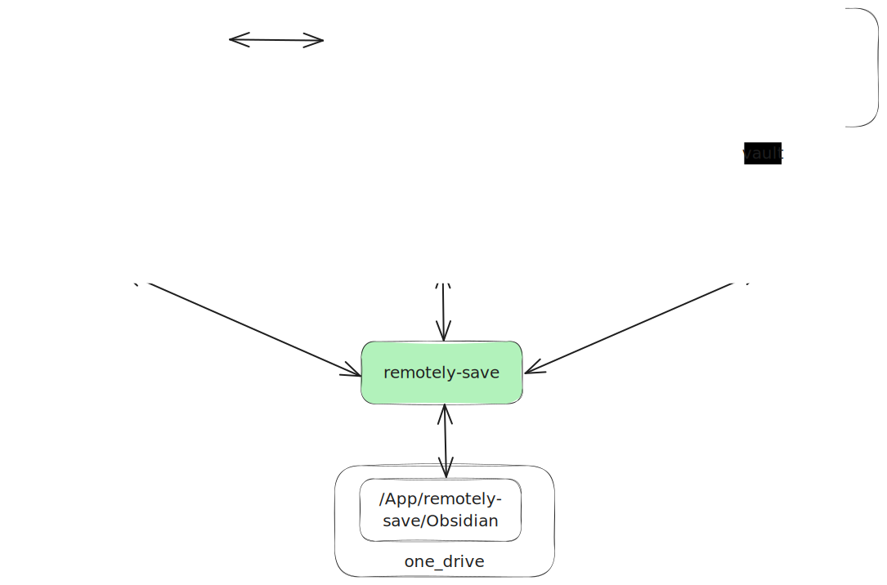

# 跨平台同步办法
- macbook:  **macbook中 `文稿` 等同于 `~/Document`**
	- 本机: 新建 `~/Document/xuechengyun_sync`文件夹
	- Obsidian: 打开本机 vault 目录`~/Document/xuechengyun_sync/Obsidian`
	- icloud：设置 icloud 同步 `文稿` 文件夹
	- 百度云: 同步 `~/Document/xuechengyun_sync`文件夹。百度云仅作为备份
- 安卓:
	- 本机:  新建 `个人/Obsidian` 文件夹
	- Obsidian: 打开本机 vault  目录 `个人/Obsidian`
- ipad:
	- Obsidian: 从 icloud  打开云端 vault 目录 `文稿/xuechengyun_sync/Obsidian`
	
- Obsidian 插件 remotely-save: 各个平台的 Obsidian 安装 remotely-save 插件后开启同步，插件会将本地 vault 目录同步至 one_drive `应用/remotely-save/Obsidian` 文件夹

# Q&A
1. Q: 为什么在 macbook 本地新建的文件夹在 `~/Document` 下？
	- A: icloud 只能设置同步"桌面与文稿文件夹" ，也就是 `~/Desktop` 和 `~/Document`
2. Q: 是否可以设置 one_drive 同步多个不同的 Obsidian vault？
	- A: 不行。Obsidian 插件 remotely-save 的 Onedrive (个人版) (App Folder）功能，只能读写 `/应用/removely-save/Obsidian` 目录，所以只能将 vault 同步到这个目录，如果同步多个 vault可能造成文件混乱
	
